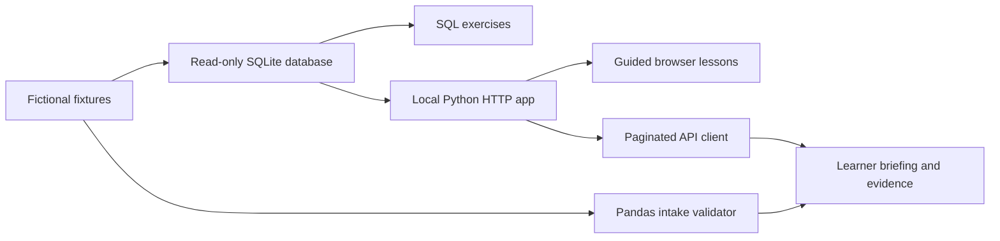

# Vibe Deploy Guardrails

**Build with AI. Release with evidence.**

A practical technical bridge for experienced operators, founders, product people and transitioning military members who use AI to code. Start with SQL, learn Python and APIs, then practice controlled software deployment. Basic Python familiarity helps; professional engineering experience is not assumed.

AI can produce working-looking software faster than a learner can evaluate its assumptions. This course builds the ability to inspect the data, ask useful technical questions, test a change and recover a known-good state. Functional checks, independent verification and configuration control provide useful operational parallels.

## Start with one lesson

Use Python 3.12 or newer and a Bash terminal in the repository folder. The browser and SQL lessons need no third-party Python packages. Later Python lessons install a separate, pinned data toolkit; Docker and GitHub are introduced later.

```bash
python3 -m ops_data.seed
python3 -m guardrails.app
```

Seed once. If the database already exists, keep it and proceed to the second command. Open [your local course](http://127.0.0.1:8000) and choose **Start lesson 1**. Read explanations in the browser; run labeled commands in a second terminal. Leave the server terminal running. Stop it with Ctrl+C.

[Detailed setup](START_HERE.md) · [Course map](CURRICULUM.md) · [Progress checkpoints](assessments/checkpoints.md)

## What you build

A fictional UAS company needs a reliable customer briefing from mission, qualification, aircraft, maintenance and flight records. You will inspect its SQLite database, diagnose bad queries, quarantine questionable CSV rows, fetch paginated API data and implement a tested briefing change. Then package, observe and recover a local release.

The repository supplies fixtures, reference tools and worked solutions. Your portfolio contribution is the queries, explanations, tests, changes and release evidence you produce yourself. Keep assisted work distinct from unaided demonstrations. This is training, not a claim of professional software engineering or production deployment experience.

## The learning route

The default route is 12 weeks at 8–10 hours a week, with checkpoints every two weeks. An eight-week foundation route is available; repeat exercises and extend the schedule when needed. Completion is measured by evidence and explanation, not elapsed time.

| Phase | Practice |
| --- | --- |
| 1. Data fluency | Nine SQLite labs: filters, aggregation, joins, CTEs, dates, windows, NULLs, duplicates and query debugging |
| 2. Python for operators | Six labs: pandas, CSV/JSON, validation, requests, pagination, authentication, configuration and automation |
| 3. Change control | Git, branches, PRs, review and automated functional tests |
| 4. Reproducible environments | Dependencies, secrets, least privilege and Docker |
| 5. Deployment | CI/CD, environment boundaries, health checks and logs |
| 6. Safe release | Known-good state, rollback, progressive rollout and audit records |
| 7. Security and AI review | Scans, access controls, insecure defaults and unsupported assumptions |
| 8. Capstone | Customer briefing, controlled release rehearsal, interview demonstration and case study |

The [curriculum](CURRICULUM.md) links every lesson and preserves the original 12 deployment labs. [Interview translation](INTERVIEW_TRANSLATION.md) and [case studies](case-studies/README.md) help turn demonstrated learning into honest portfolio evidence.

## Architecture and limits



The server uses Python’s standard library. The optional data toolkit uses pandas and requests. A demonstration token protects a local configuration endpoint; it is not production customer authorization. Synthetic wind limits and readiness checks are not aviation guidance. The server is for local practice, not internet hosting.

CI runs tests and builds a container. The Release rehearsal workflow operates an ephemeral container on a GitHub runner; it does not deploy a hosted service. Repository protection and release approval require explicit GitHub configuration. See [deployment boundaries](docs/deployment.md) and the [scenario](docs/scenario.md).

## Check your setup

```bash
python3 -m unittest discover -s tests -v
python3 scripts/check_docs.py
```

For Phase 2, follow its virtual-environment setup and install `requirements-data.txt` with `--require-hashes`, then run `python -m unittest discover -s tests_data -v`.

## Keep these beside your AI assistant

- [Pre-release checklist](checklists/pre-release.md)
- [AI review prompt and red flags](docs/ai-review.md)
- [Release record](checklists/release-record.md)
- [Incident and rollback checklist](checklists/incident.md)
- [Plain-language glossary](docs/glossary.md)

## Repository map

```text
guardrails/       Small, read-only Python web app
lessons/          SQL and Python learning tracks
ops_data/         SQLite, validation and API reference tools
labs/             Preserved deployment guardrails exercises
assessments/      Milestones and unaided checkpoints
tests/           Functional-rule and HTTP integration tests
scripts/          Smoke test, container check, documentation check
.github/          CI, scans, rehearsal, contribution templates
checklists/       Release and incident evidence templates
docs/             Setup, architecture, operations, GitHub setup, references
```

## Contribute or teach

Beginner confusion is useful feedback. Please report the step you tried, what you
expected, and what happened. [Contribution guidance](CONTRIBUTING.md) includes a review
procedure and a facilitator option. Code and course text are available under the
[MIT license](LICENSE). See [security reporting](SECURITY.md) before disclosing a vulnerability.

## Publish your copy

Follow [GitHub setup](docs/github-setup.md) to create the repository, run the first
checks, and configure branch and environment protection. Those protections are account
settings; copying this repository does **not** turn them on.

[Validation report](docs/validation.md) records what was actually checked for this build.
[Changelog](CHANGELOG.md) records the scope and the unavailable v0.1 source artifact.
