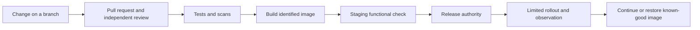

# Vibe Deploy Guardrails

**Build with AI. Release with evidence. Recover with confidence.**

A hands-on introduction to software deployment for operators, founders, product people,
transitioning military members, and anyone whose coding experience starts with Python
notebooks and AI experimentation.

You do not need to become a software engineer to ask useful release questions:
**What changed? Who checked it? Does it work? What can it access? How do we recover?**

This course turns those questions into habits through a small Python app and 12 practical
labs. You will deliberately break a functional check, review a change, package a release,
inspect logs, introduce a feature gradually, and restore a known-good state.

> **Training release: v0.2.0.** The app runs locally and uses no paid service, API key,
> or third-party Python package. Docker and a GitHub account are needed for later labs.
> This is a deployment learning environment, not an internet-facing production server.

## Start here

Download and extract the repository, or clone your copy from GitHub. Open a terminal
in the folder containing this README. Commands below use Bash on macOS, Linux, or
Windows through WSL. See [setup and troubleshooting](docs/setup.md) if those words are new.
Use Python 3.12 or newer.

```bash
python3 --version
python3 -m unittest discover -s tests -v
python3 -m guardrails.app
```

Open **http://127.0.0.1:8000** in your browser. Choose “All evidence present” and then
“Functional check failed.” The first returns `"ready": true`; the second returns
`"ready": false`. Stop the app with **Ctrl+C**.

In a second terminal, while the app is running:

```bash
python3 scripts/smoke.py
```

Expected: `PASS: identity, health, approval and hold behavior`.
A smoke test is a short functional check of a running system.

**Next: [Lab 00 — Establish a baseline](labs/00-baseline.md).**

## What you will practice

Plan on roughly 8–12 hours, spread over several sessions. Allow additional time for
first-time Git, Docker, and GitHub setup. Each lab gives you a mission, steps, expected
results, a fault to investigate, recovery instructions, and evidence to keep.

| Lab | Mission | Operational connection |
| --- | --- | --- |
| [00](labs/00-baseline.md) | Run and identify the app | Establish a baseline |
| [01](labs/01-git.md) | Track and reverse changes | Configuration control |
| [02](labs/02-review.md) | Review an AI-assisted change | Independent verification |
| [03](labs/03-testing.md) | Prove the release rule | Functional checks |
| [04](labs/04-configuration.md) | Separate environments and secrets | Correct configuration for the mission |
| [05](labs/05-dependencies.md) | Inspect dependencies and scans | Parts provenance and service bulletins |
| [06](labs/06-docker.md) | Package and restrict the app | Controlled equipment configuration |
| [07](labs/07-ci.md) | Require automated checks | Release gates |
| [08](labs/08-observability.md) | Read operating evidence | Instrumentation and fault isolation |
| [09](labs/09-release-rollback.md) | Rehearse promotion and recovery | Return to service and known-good state |
| [10](labs/10-flags.md) | Expose a feature gradually | Limited introduction with stop criteria |
| [11](labs/11-capstone.md) | Deliver an AI-assisted change | Complete change-control package |

These analogies support learning; this course is not an aviation procedure or certification.
The app's “ready” result evaluates supplied booleans. It cannot establish that a human
review actually happened or authorize a real release.

## How the pieces fit



The included CI checks pull requests. The manual **Release rehearsal** workflow runs
an ephemeral container on a GitHub runner and records evidence. It does not publish
an image or deploy a hosted service. The [deployment guide](docs/deployment.md) explains
that boundary and the additional controls needed for real hosting.

## Keep these beside your AI assistant

- [Pre-release checklist](checklists/pre-release.md)
- [AI review prompt and red flags](docs/ai-review.md)
- [Release record](checklists/release-record.md)
- [Incident and rollback checklist](checklists/incident.md)
- [Plain-language glossary](docs/glossary.md)

## Repository map

```text
guardrails/       Small, read-only Python web app
labs/             Sequential exercises and a capstone
tests/           Functional-rule and HTTP integration tests
scripts/          Smoke test, container check, documentation check
.github/          CI, scans, rehearsal, contribution templates
checklists/       Release and incident evidence templates
docs/             Setup, architecture, operations, GitHub setup, references
```

## Contribute or teach

Beginner confusion is useful feedback. Please report the step you tried, what you
expected, and what happened. [Contribution guidance](CONTRIBUTING.md) includes a review
procedure and a facilitator option. Code and course text are available under the
[MIT license](LICENSE). See [security reporting](SECURITY.md) before disclosing a vulnerability.

## Publish your copy

Follow [GitHub setup](docs/github-setup.md) to create the repository, run the first
checks, and configure branch and environment protection. Those protections are account
settings; copying this repository does **not** turn them on.

[Validation report](docs/validation.md) records what was actually checked for this build.
[Changelog](CHANGELOG.md) records the scope and the unavailable v0.1 source artifact.
