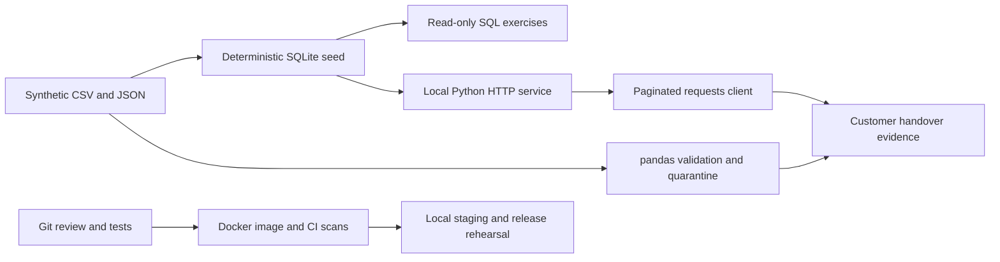

# Scenario — Harborline UAS (fictional)

Harborline UAS has won its first substantial industrial/customer trial. Harbor Survey
(C01) and Ridge Utilities (C02) need trustworthy mission information and a controlled
software rollout. All names, records, conditions and figures are invented for learning.
No result in this course grants flight authority or represents regulatory compliance.

The learner acts as an implementation lead: map the workflow, inspect customer data,
make discrepancies visible, ask engineers precise questions, rehearse release, and
explain evidence to operators and leadership. The learner is not cast as a professional
software, data or ML engineer.

## Workflow

Customer requirement → scheduled mission → aircraft and operator assignment →
qualification/maintenance/risk evidence → flight record → data-quality review →
customer report → software release → observation/incident response.

| Table | One row means | Key and relationship |
| --- | --- | --- |
| customers | One fictional customer and its demonstration limit | customer_id |
| operators | One fictional operator | operator_id |
| aircraft | One aircraft's current state | aircraft_id |
| qualifications | One qualification per operator/type | operator_id + qualification |
| missions | One planned or historical mission | mission_id; references customer, aircraft, operator |
| flight_logs | One authoritative accepted flight record | flight_id → mission_id |
| maintenance | One maintenance discrepancy | maintenance_id → aircraft_id |
| risk_approvals | One current risk decision per mission | mission_id |
| releases | One demonstration software version | version |
| deployments | One version installed in one customer/environment | deployment_id |
| incidents | One reported software incident | incident_id → deployment_id |
| flight_intake | One unvalidated imported row | row_id; external identifiers may be defective |

Dates are fixed; use 2026-09-15 for assessment. All times are UTC. Qualifications are
current through the expiry date for this fictional exercise. C01's demonstration wind
limit is 20 knots; C02's is 15. These are invented customer settings, not flight guidance.

## Limits to make explicit

Current aircraft status is not a time series of historical maintenance state. A risk
record may be missing; it is not implicitly approved. A query result is not verification
of actual qualification or safety. The database contains no real customers or credentials.
The API is local/read-only; it is not a multi-tenant production service.

## Architecture

The guided browser pages explain the lesson. JSON endpoints serve programs. The SQL
runner is read-only and does not accept browser-submitted SQL. pandas/requests are
optional learning dependencies outside the server image. The app uses no third-party
runtime Python packages; its OS and Python runtime still require updates and scans.
